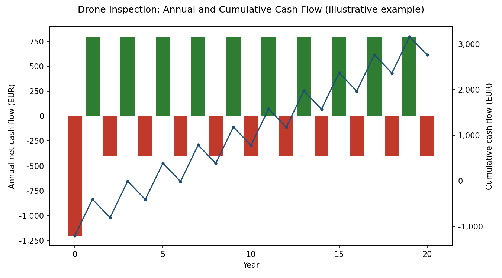
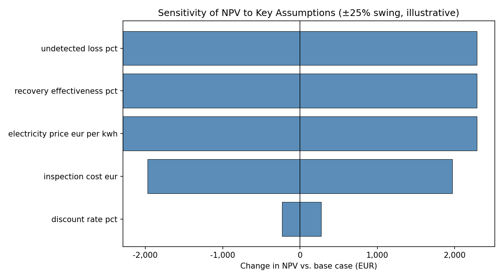

# Drone Inspection ROI Calculator (Illustrative Example)

A financial model that evaluates whether periodic drone-based thermal
inspection of a PV system pays for itself, using standard capital
budgeting techniques: Net Present Value (NPV), Internal Rate of Return
(IRR), payback period, and one-at-a-time sensitivity analysis.

**This is a generic, openly published demonstration of the modeling
methodology.** All figures in `data/example_scenario.json` are
illustrative assumptions for a hypothetical system, not real data from
any company, client, or asset. The core financial functions (NPV, IRR,
payback) are implemented from scratch in plain Python — no numerical
finance library is used — so the logic is fully transparent and auditable.

## The idea in one paragraph

A PV system produces an expected amount of energy every year. Without
inspection, faults (hotspots, bypass diode failures, string outages,
soiling) can silently reduce that production for months before anyone
notices in a monthly energy bill. Periodic drone thermal inspection
catches these faults early, so most of that lost production is
recovered through timely repair. The inspection cost is a recurring
investment; the value of the recovered production is the return. This
project treats that decision exactly like any other capital investment
and scores it with NPV, IRR, and payback period.

## Project Structure

| File / Folder | Description |
|---|---|
| `src/roi_model.py` | Core financial functions: NPV, IRR (bisection), payback period, cash flow construction |
| `src/sensitivity.py` | One-at-a-time sensitivity analysis (tornado chart data) |
| `src/main.py` | Loads a scenario, prints a summary, generates the two charts below |
| `data/example_scenario.json` | Illustrative input assumptions (edit this to try your own numbers) |
| `data/output/` | Generated charts (ignored by Git, regenerated by running the script) |
| `requirements.txt` | Project dependencies |

## How the model works

**Inputs** (see `data/example_scenario.json`):

- `system_kwp`, `specific_yield_kwh_per_kwp` — expected annual production
- `electricity_price_eur_per_kwh` — value of each kWh recovered
- `undetected_loss_pct` — share of annual production assumed lost to undetected faults
- `recovery_effectiveness_pct` — share of that loss actually recoverable through inspection + repair
- `inspection_cost_eur`, `interval_years` — the recurring cost of the service
- `discount_rate_pct`, `horizon_years` — standard NPV/IRR parameters

**Cash flow construction:** Year 0 is the cost of the first inspection.
Every subsequent year receives the value of the avoided production
loss; on interval years, the next inspection cost is subtracted. This
produces a realistic lumpy cash flow series (not a smoothed annual
average), which is what the NPV/IRR functions actually evaluate.

**NPV** discounts every cash flow to present value and sums them.

**IRR** is found by scanning discount rates from 0% to 300% for a sign
change in NPV, then refining with bisection. The scan is deliberately
restricted to economically plausible rates: for long horizons, NPV as
a function of the discount rate blows up numerically as the rate
approaches -100% (the discount factor explodes), which can produce
spurious sign changes at meaningless deeply-negative rates if the scan
isn't bounded. This is a real numerical pitfall worth knowing about
when implementing IRR by hand instead of using a packaged formula.

**Sensitivity analysis** varies each key assumption by ±25% one at a
time, holding everything else fixed, and records the resulting NPV —
the standard "tornado chart" approach for showing which assumptions
the conclusion is most sensitive to.

## Example output (illustrative scenario)

Running the model on the example scenario (500 kWp system, 3% assumed
undetected loss, 70% recovery effectiveness, €1,200 per inspection
every 2 years, 6% discount rate, 20-year horizon):

```
NPV:              EUR 1,271
IRR:              20.7%
Payback period:   5 years
```


*Cash flow pattern: a cost every 2 years, offset by the annual value of avoided production loss. The cumulative line crosses zero at the payback point.*


*Which assumption the NPV conclusion depends on most. In this example, the undetected-loss assumption and the electricity price matter far more than the inspection cost itself — meaning the case for inspection is more sensitive to "how much is really being lost" than to "how much the inspection costs."*

## Usage

```bash
pip install -r requirements.txt
python src/main.py
```

To try your own numbers, edit `data/example_scenario.json` and re-run.
No paths need to be changed.

## Honest limitations

- **The two most sensitive assumptions — undetected loss % and
  recovery effectiveness % — are the hardest to know in advance.**
  This model doesn't estimate them; it takes them as inputs. Getting
  real numbers for a specific site would require exactly the kind of
  before/after production data comparison and thermal inspection
  history that a real deployment would generate over time.
- **The model assumes a constant annual benefit and a fixed inspection
  interval.** In reality, undetected loss likely accumulates unevenly
  (a single string failure can spike losses suddenly), and the
  usefulness of a fixed 2-year interval versus event-triggered
  inspection (after storms, hail, or a sudden output drop) is a
  reasonable next question this model doesn't yet answer.
- **This does not include panel degradation, inflation of electricity
  prices, or financing costs for the inspection service itself** — all
  of which a fuller model would need for a real investment decision.

## Related project

This project pairs with my [solar panel hotspot detection
pipeline](https://github.com/emrecan-oz/solar-panel-hotspot-detector),
which handles the technical side (finding faults in thermal drone
imagery); this one handles the financial side (whether finding them is
worth paying for).
